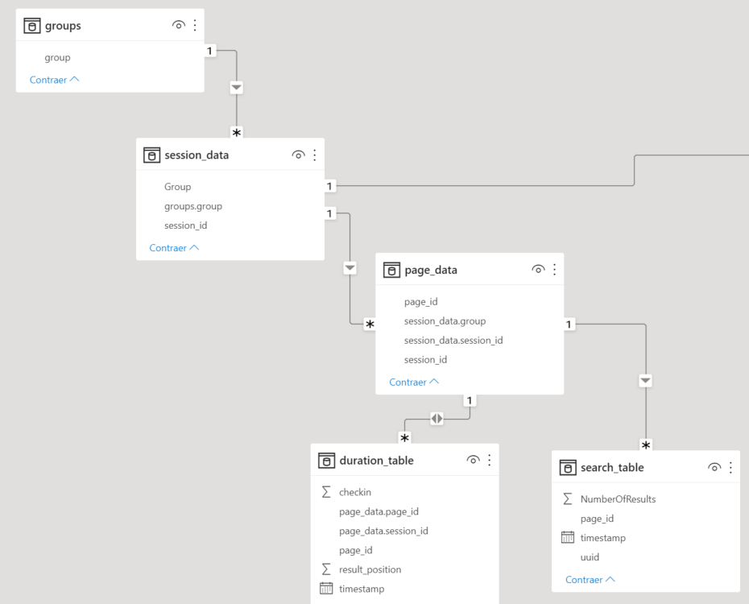

# Navigation Analytics
Toolkit that creates portable objects specialized on analyzing web navigation data.

# Installation

This package is available in pypi and can be installed using pip:

```
pip install navigation_analytics
```

# Rationale

The package expects a data model as follows:



It mainly consists of the following tables:

* **duration_table**: Provided a page (`page_id` visited by an user, it stores the approximate duration of the user in that
single page (`checkin`), it also provides the ranking of that page when it was searched (`result_position`).

* **search_table**: Provides the number of results linked to a page_id.

* **page_data**: Look up table of the page_id (primary key) used in duration_table and search_table.
It also links every page_id with a `session_id`.

* **session_data**: Look up table with all session_ids (primary key). It associates every session with a group.

* **groups**: List of groups defined for each session.

This relational model allows to define a data structure that preserves data integrity, and enables to perform A/B testing in a safe fashion.
Furthermore this data structure, namely NavigationDataAnalyzer allows to compute the following metrics:

* Click Through Rate

* Most Common Result

* Session Length

* Zero Result Rate

Further it allows to save the object with their results as a pickle, enabling thus its traceability and storage in a data lake.
Results can also be exported in an Excel Spreadsheet.

# Config

Before using the Navigation Data Analyzer it is compulsory to define a config file or dictionary with the following information:

```{json}
{
  "metadata": {
    "data_types": { -- Provides the data types of the input table containing the data to be analyzed.
      "uuid": "str",
      "timestamp": "float",
      "session_id": "str",
      "group": "str",
      "action": "str",
      "checkin": "float",
      "page_id": "str",
      "n_results": "float",
      "result_position": "float"
    },
    "primary_keys": { -- Provides the names of 3 of the 5 primary keys in data, this is the hierarchy: events - pages - sessions
      "events": "uuid",
      "pages": "page_id",
      "sessions": "session_id"
    },
    "valid_values": { -- Information of column names and valid values in data.
      "groups": { -- Name of the column defining the groups and the correct/valid values of such.
        "group_id": "group",
        "valid": ["a", "b"]
      },
      "actions": { -- All valid actions to be performed during a session and the name of the column with this information.
        "action_id": "action",
        "valid": ["checkin", "searchResultPage", "visitPage"],
        "search_action": "searchResultPage",
        "visit_action": "visitPage"
      },
      "kpis": { -- Name of the columns containing KPIs
        "number_results": "n_results",
        "result_position": "result_position",
        "duration_page": "checkin"
      }
    },
    "na_vector": ["NA"], -- String expressing how NAs values are expressed in data.
    "datetime": "timestamp", -- Name of the column with timestamp
    "date_format": "%Y%m%d%H%M%S" -- Format of the date in the data.
  }

}
```

This dictionary is used to perform sanity checks and avoid hardcoded values in the script.

# Demos

This section provides a series of short demos with hands-on examples of how to use this package.

## 1. Computing Click Through Rate

``` {Python}
data_analyzer = NavigationDataAnalyzer(input_data=input_data,
                                           metadata=metadata)
# General ctr
data_analyzer.session_analyzer.compute_click_through_rate()
```

## 2. Computing Ranking of results

``` {Python}
data_analyzer = NavigationDataAnalyzer(input_data=input_data,
                                           metadata=metadata)
data_analyzer.session_analyzer.session_analyzer.compute_search_frequency()
```

## 3. Computing Zero Result Rate For Group 'a'

``` {Python}
data_analyzer = NavigationDataAnalyzer(input_data=input_data,
                                           metadata=metadata)
data_analyzer.session_analyzer.session_analyzer.compute_zero_result_rate(group_id='a')
```

## 4. Computing Median Session duration for Group 'b'

``` {Python}
data_analyzer = NavigationDataAnalyzer(input_data=input_data,
                                           metadata=metadata)
session_length_b = data_analyzer.session_analyzer.compute_session_length(group_id='b')
session_length_b.median()
```

## 5. Saving an object

``` {Python}
data_analyzer = NavigationDataAnalyzer(input_data=input_data,
                                           metadata=metadata)
data_analyzer.save(path_location)
```
